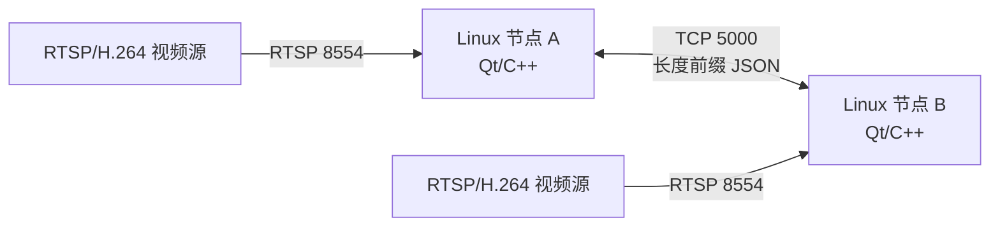

# 系统结构



## 文本协议

每个数据帧：`4 字节大端长度 + UTF-8 JSON`。

```json
{
  "type": "text",
  "id": "uuid",
  "timestamp": 1784909400000,
  "content": "收到，可以开始通信。"
}
```

支持 `hello`、`text`、`ack`、`heartbeat` 四种消息。
